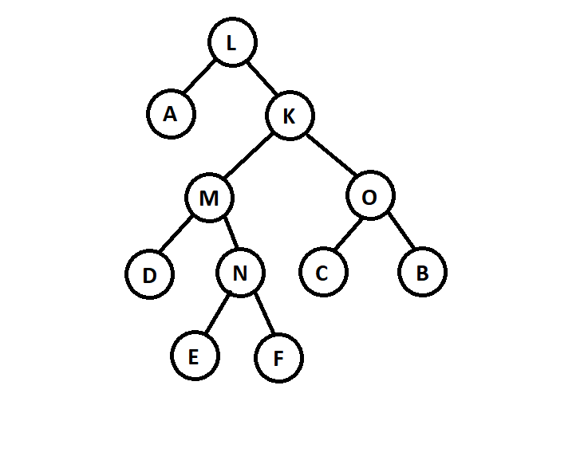

# CS 1501 - Lab #2 (Binary Tree Traversal)[^1]

## Table of Contents

- [Overview](#overview)
- [Binary Tree Traversal](#binary-tree-traversal)
- [Tasks](#tasks)
- [Testing](#testing)
- [Submission](#submission)

## Overview

 __Purpose__: In this lab, you will complete the implementation of a Binary Tree traversal.

The starter project has been provided to you with the following content:

- `TreeFile.java` - The file you will edit, including three places marked by the `TODO` comments, where you must finish the code implementation.
- `sample.txt` - A sample tree for the program.
- `tree1.txt` - A sample tree for the program.
- `expectedoutput.txt` - Sample execution and the expected output for the program.

## Binary Tree Traversal

There are three main types of _depth-first_ traversal for a given binary tree:

- Preorder - Visit the root before the left and right subtrees.
- Inorder - Visit the left subtree, root, and the right subtree.
- Postorder - Visit the left and then right subtrees before the root.

Using the binary tree below as an example:



The visit order for the three methods will be as follows:

- Preorder - __L, A, K, M, D, N, E, F, O, C, B__
- Inorder -  __A, L, D, M, E, N, F, K, C, O, B__
- Postorder - __A, D, E, F, N, M, C, B, O, K, L__

In the lab, the `readTree` and `writeTree` methods are done using preorder traversal of the tree. The process is done recursively due to the recursive structure of the tree.

## Tasks

In this lab, we will read a Binary Tree from a text file, modify it by attaching other nodes, and write the resulting tree into a text file.

The program should also be able to display a tree using inorder traversal, which is done for you. 

## Testing

Compile the Java file after completing the tasks. Once compiled, you can run the class file without command-line arguments.

``` powershell
cd #YOUR_LAB2_DIRECTORY
javac *.java 
java TreeFile
```

You can also [run the program directly from VS Code](https://code.visualstudio.com/docs/java/java-tutorial). 

The input for execution and the corresponding expected output can be found in `ExpectedOutput.txt`.

## Submission

- The only file you can modify is the `TreeFile.java` file.
- `commit` and `push` the finished code to your GitHub repository. You can check the following [page](https://code.visualstudio.com/docs/sourcecontrol/github) to set up GitHub access directly from VS Code. If you think the commit command hangs in VS Code, it probably asks for a commit message in an open file. You would then need to enter a message and close the file before it can commit to GitHub.
- Submit your Github repository to GradeScope for automatic grading.
  
Note: If you use an IDE, such as NetBeans, Eclipse, or IntelliJ, to develop your programs, make sure the programs will compile and run on the command line before submitting – this may require some modifications to your program (e.g., removing package information).

[^1]: Contributed by [Alex Zhou](https://github.com/yuz727)
